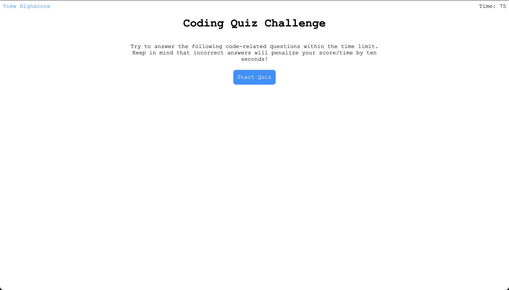
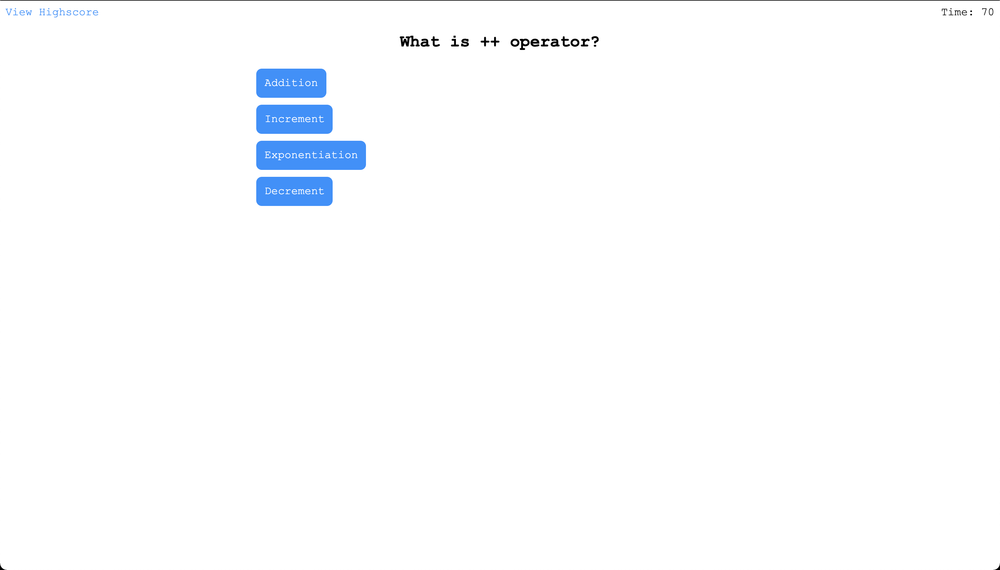
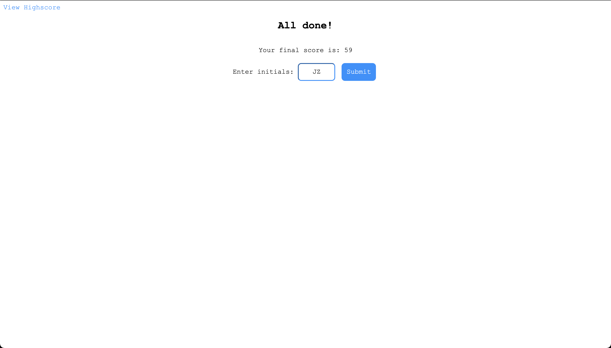
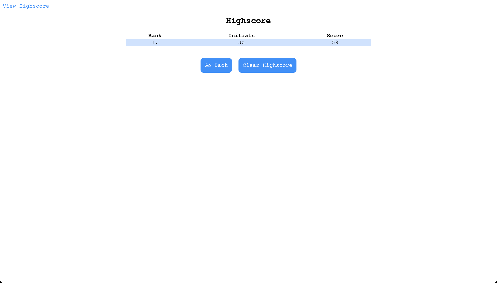

# Code-Quiz

## Link To Website
https://bytesizeerror.github.io/Code-Quiz/

## About The Project
This project was a quiz that tests users on operators. The user will be scored on how much time they have left after answering all the questions. Each incorrect answer will penalize their time by 10 seconds. After the user finishes the quiz they would be prompted to fill in their initials for the leaderboard.

## Project Demo
### Start screen

* This screen is displayed when the user first comes to the site. 
* They can press start to start the quiz or look at the previous highscores by clicking view highscores at the top left.

### Question Screen

* The user will be presentd with 10 questions about common Javascript operators. 
* Each incorrect response will penalize the user by 10 seconds.

### End Screen

* Here the user is shown their final score.
* They can enter their initials to be saved on the leaderboard.

### Highscore Screen

* On this screen the user can view their previous highscore and others score.

## Usage
To help the user test their knowledge on common Javascript operators and to track their scores compared to others.